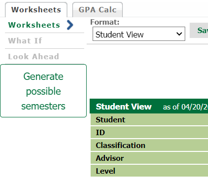
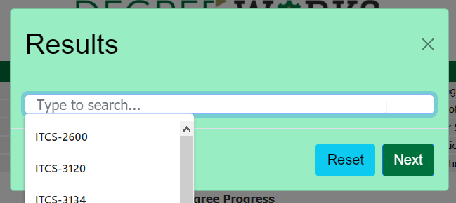

# DegweeWorks

DegweeWorks is a browser extension which 
  helps you plan out which courses you intend to take to complete your degree.

## Table of Contents

- [Requirements](#requirements)
- [Installation](#installation)
   - [Chrome](#chrome)
   - [Microsoft Edge](#microsoft-edge)
- [Basic usage](#basic-usage)

## Requirements
1. Chrome or Microsoft Edge

## Installation

Add the extension to your browser 

### Chrome
Navigate to `chrome://extensions/` and select "Load unpacked" 
      then select the folder containing this README

### Microsoft Edge
Same as above but navigate to `edge://extensions/` instead of `chrome://extensions/`

## Basic usage
1. Navigate to https://degreeworks.uncc.edu/DashboardServlet/
2. Login if necessary
3. Wait for your schedule to finish loading
4. Click the "generate possible semesters" button:
   
   
5. Click into the "Type to search..." box and select a course you'd like to take then click "Next"
   

6. Repeat this process until you have selected enough courses for degree completion (you will be notified).

DegweeWorks also works on degrees generated on the "What If" page of DegreeWorks.  
Simply generate a "What If" degree then follow steps 3-6.

## Featured user-stories

- **ST-2**	As a UNCC student, I would like the plug-in to load when I visit DegreeWorks automatically so that I do not need to press a button.
- **ST-4**	As a student, I would like to use this app in Edge.
- **ST-5**	As a student, I would like to use this app in Chrome.
- **ST-6**  As a UNCC student, I would like to be able to view multiple different schedules so that I can know my options
